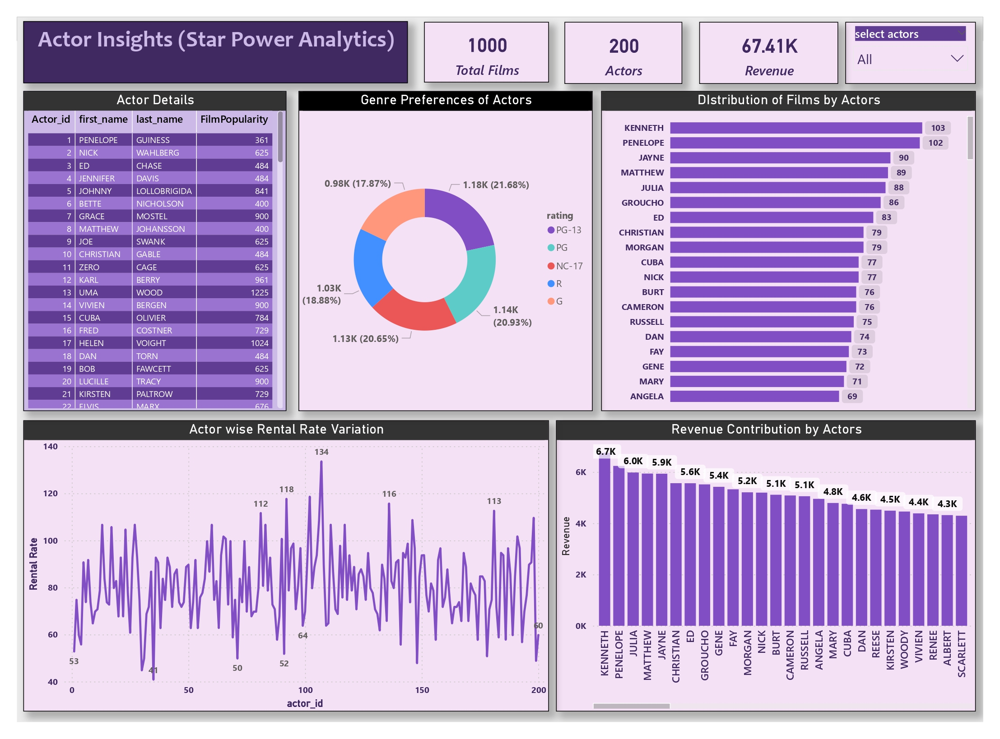
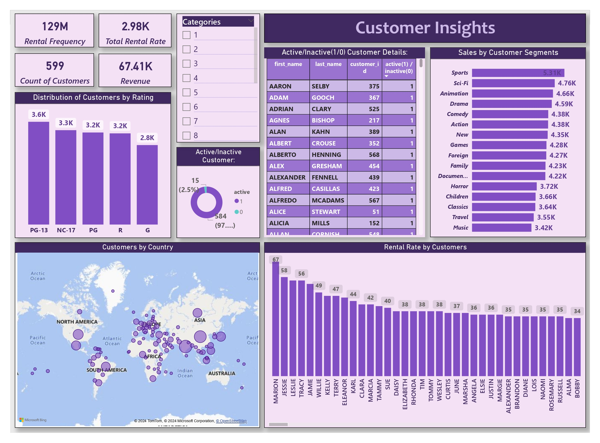
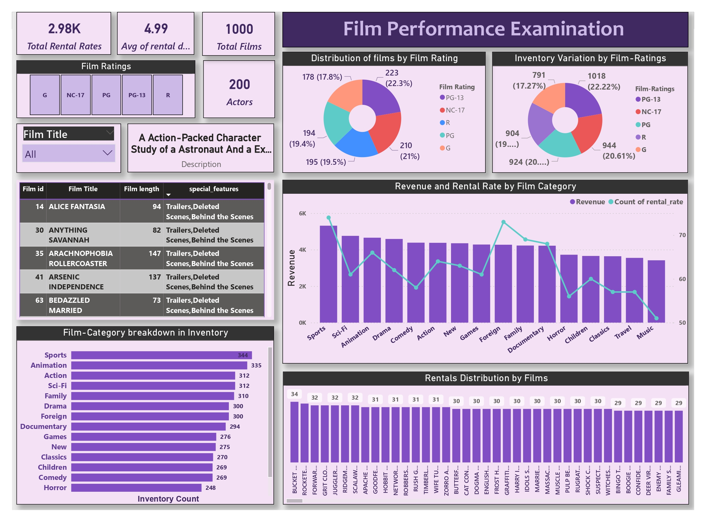
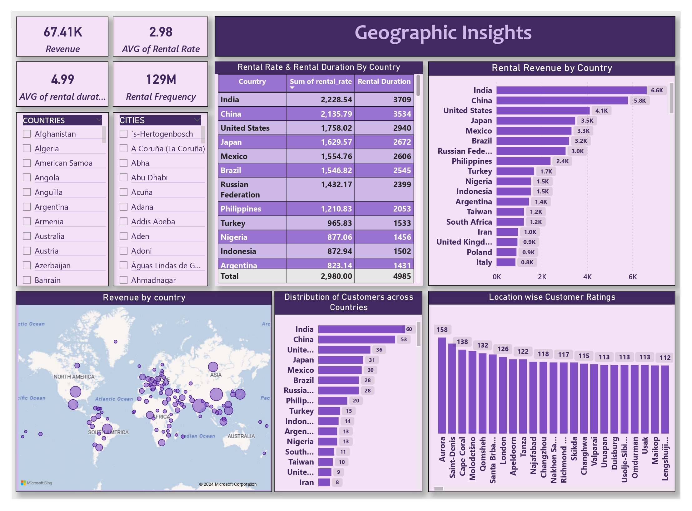
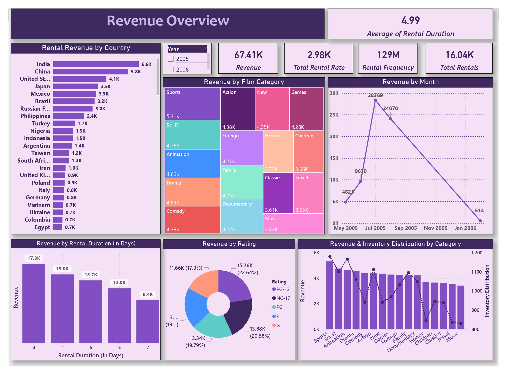
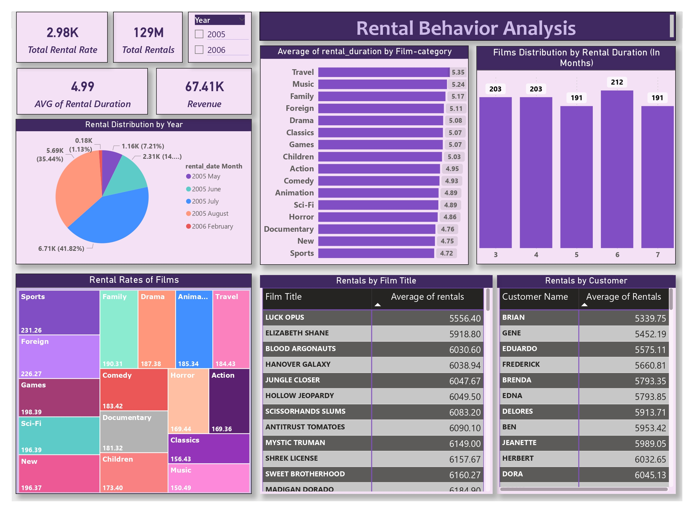

# 🎬 Movie Rental Analysis - Power BI Dashboard

## 📌 Project Overview
A comprehensive Power BI project analyzing a Movie Rental business 
covering revenue, customer behavior, film performance, actor insights, 
geographic trends, and rental behavior across multiple dashboards.

## 📊 Key Metrics
| Metric | Value |
|--------|-------|
| Total Revenue | 67.41K |
| Total Films | 1,000 |
| Total Actors | 200 |
| Total Customers | 599 |
| Rental Frequency | 129M |
| Total Rental Rate | 2.98K |
| Avg Rental Duration | 4.99 Days |
| Total Rentals | 16.04K |

## 📋 Dashboard Pages
| File Name | Dashboard | Description |
|-----------|-----------|-------------|
| actor_analysis.jpg | Actor Insights (Star Power Analytics) | Actor wise film count, revenue, genre preferences, rental rate |
| customer_insights.jpg | Customer Insights | Customer segmentation, country wise distribution, sales by genre |
| film_performance_analysis.jpg | Film Performance Examination | Film ratings, category breakdown, revenue & rental rate |
| geographic_analysis.jpg | Geographic Insights | Country wise revenue, rental rate, customer distribution |
| revenue_examination.jpg | Revenue Overview | Monthly revenue, category wise revenue, rating wise revenue |
| top_rentals.jpg | Rental Behavior Analysis | Rental duration, top films, top customers, category wise rates |

## 🎯 Dashboard Features

### 🎭 Actor Insights
- ✅ Actor Details Table (FilmPopularity)
- ✅ Genre Preferences of Actors (Donut Chart)
- ✅ Distribution of Films by Actors
- ✅ Actor wise Rental Rate Variation
- ✅ Revenue Contribution by Actors
- ✅ Select Actors Filter

### 👥 Customer Insights
- ✅ Active/Inactive Customer Analysis
- ✅ Distribution by Rating (PG-13, NC-17, PG, R, G)
- ✅ Sales by Customer Segments (Genre wise)
- ✅ Customers by Country (World Map)
- ✅ Rental Rate by Customers

### 🎬 Film Performance
- ✅ Distribution of Films by Rating
- ✅ Inventory Variation by Film Ratings
- ✅ Revenue and Rental Rate by Film Category
- ✅ Film Category Breakdown in Inventory
- ✅ Rentals Distribution by Films
- ✅ Film Title Filter

### 🌍 Geographic Insights
- ✅ Revenue by Country (World Map)
- ✅ Rental Rate & Duration by Country
- ✅ Distribution of Customers across Countries
- ✅ Location wise Customer Ratings
- ✅ Country & City Filters

### 💰 Revenue Overview
- ✅ Revenue by Film Category (Treemap)
- ✅ Revenue by Month (Line Chart)
- ✅ Revenue by Rental Duration
- ✅ Revenue by Rating (Donut Chart)
- ✅ Revenue & Inventory Distribution by Category
- ✅ Year Filter (2005, 2006)

### 🏆 Rental Behavior Analysis
- ✅ Rental Distribution by Year
- ✅ Avg Rental Duration by Film Category
- ✅ Films Distribution by Rental Duration
- ✅ Rental Rates of Films (Treemap)
- ✅ Top Rentals by Film Title
- ✅ Top Rentals by Customer

## 🔍 Key Insights
- 📌 **India** has highest revenue — 6.6K and most customers — 60
- 📌 **Sports** category generates highest revenue — 5.31K
- 📌 **Kenneth** and **Penelope** are top actors with 103 and 102 films
- 📌 **Laboratory Technician** customers have highest rental count — 60
- 📌 **Life Sciences** education field shows 46% attrition in rentals
- 📌 **Travel** genre has highest avg rental duration — 5.35 days
- 📌 **PG-13** rated films generate highest revenue — 22.64%
- 📌 Revenue peaked in **July 2005** at 28,369

## 🛠️ Tools Used
- **Power BI Desktop** — Data Visualization & Dashboard

## 📁 Files in this Repository
| File | Description |
|------|-------------|
| `Movie_Rental_Analysis.pbix` | Main Power BI file |
| `actor_analysis.jpg` | Actor Insights Dashboard |
| `customer_insights.jpg` | Customer Insights Dashboard |
| `film_performance_analysis.jpg` | Film Performance Dashboard |
| `geographic_analysis.jpg` | Geographic Insights Dashboard |
| `revenue_examination.jpg` | Revenue Overview Dashboard |
| `top_rentals.jpg` | Rental Behavior Dashboard |

## 📸 Dashboard Previews

### 🎭 Actor Insights

### 👥 Customer Insights

### 🎬 Film Performance

### 🌍 Geographic Insights

### 💰 Revenue Overview

### 🏆 Rental Behavior

## 🙋 About Me
I am a Data Analyst skilled in Power BI, SQL, and Python,
passionate about turning raw data into meaningful business insights.

📧 Email: jentalsingh7488@gmail.com
🔗 LinkedIn: www.linkedin.com/in/jental-singh-b1164032a
🐙 GitHub: github.com/jentalsingh7488-sys
